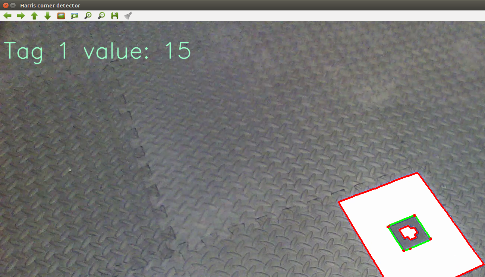
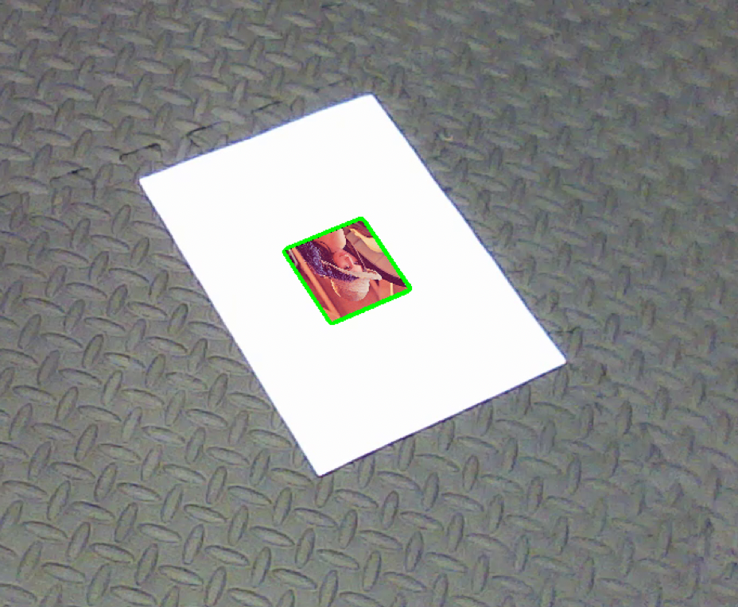
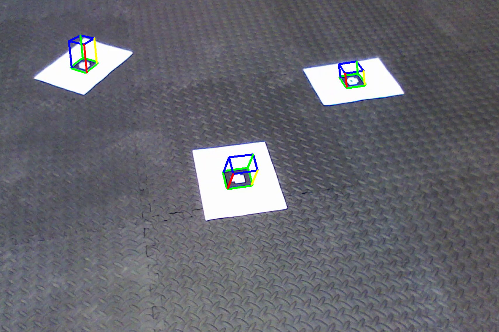
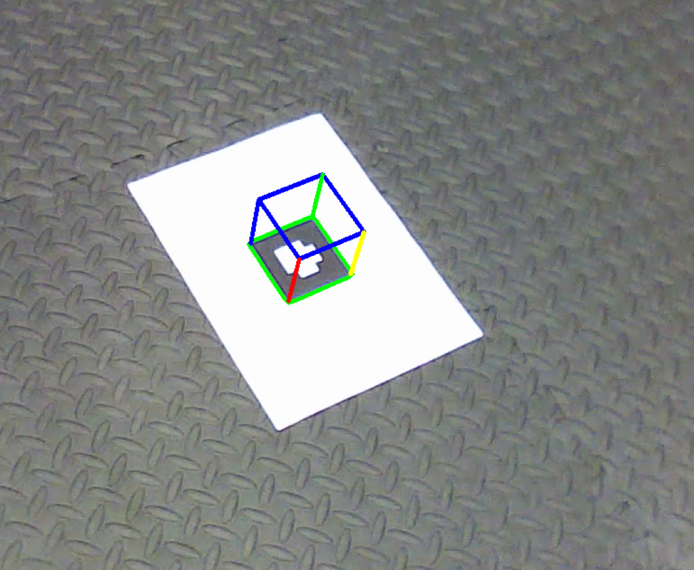

# Augmented Reality using Homography
This Project has three parts.
* Detecting AR tag and decode the value inside the AR tag.
* Superimposing a image onto the detected AR Tag.
* Projecting a virtual cube on top of the detected AR Tag.

## Results
### Detecting the AR Tag

### Superimposing a image

### Superimposing a image

 

## Instruction to run the program
1. Unzip the folder which has the code and input sequences
2. Each of the following code parts asks you to select the input sequence you would like to run the code with.
3. Run `python ./part_1.py` for AR Tag detection (1)
4. Run `python ./part_2.1.py` for Superimposing Lena image on AR Tag (2)
5. Run `python ./part_2.2.py` for Placing virtual cube on AR Tag (3)
